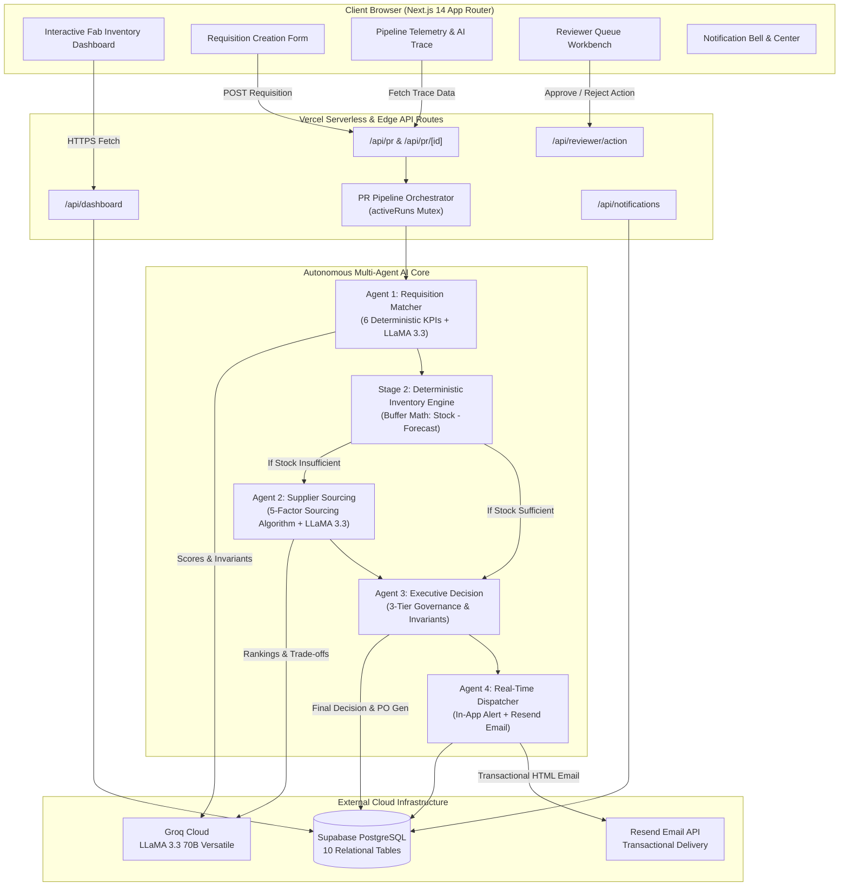
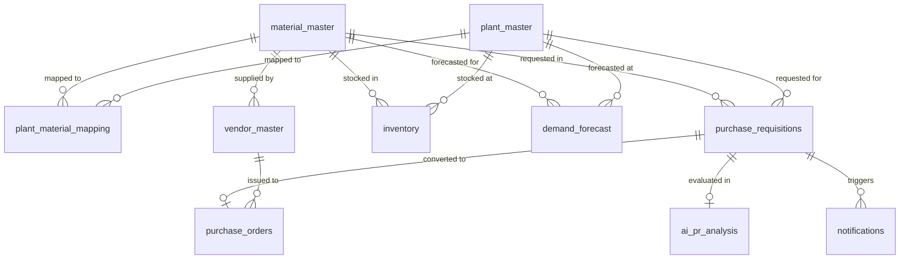

# Micron ProcureAI — Autonomous Multi-Agent Procurement System

[](https://nextjs.org/)
[](https://react.dev/)
[](https://www.typescriptlang.org/)
[](https://tailwindcss.com/)
[](https://supabase.com/)
[](https://groq.com/)
[](https://resend.com/)
[](https://jestjs.io/)
[](https://playwright.dev/)
[](https://procureai-kappa.vercel.app)

> **Autonomous Semiconductor Supply Chain Requisition & PO Generation Engine**  
> Built for the Micron Hackathon. ProcureAI accelerates purchase requisition approval from **48 hours down to under 5 seconds** through deterministic multi-factor mathematical models coupled with Groq-accelerated LLaMA 3.3 70B reasoning agents.

---

## 🌐 Live Application & Demo

- **Production URL**: [https://procureai-kappa.vercel.app](https://procureai-kappa.vercel.app)
- **Repository**: [https://github.com/RachakondaGagan/Micron-Hackathon](https://github.com/RachakondaGagan/Micron-Hackathon)
- **Automated Test Coverage**: `63/63 tests passing` (`npm test`)

---

## 📌 Executive Summary & Problem Statement

In global semiconductor fabrication (e.g., Micron Boise Fab 4, Hiroshima Fab 15, Singapore Fab 10, Sanand ATMP), manufacturing lines consume specialized chemical reagents, ultra-pure solvents, silicon substrates, and cleanroom consumables 24/7/365. Traditional manual procurement systems suffer from:

1. **Duplicate Spend Collisions**: Requisitioners in different cleanrooms unintentionally submit identical purchase orders within hours, tying up millions of dollars in duplicate inventory.
2. **Stock-Out vs. Overstock Blindness**: Requisitions are approved without cross-checking real-time safety floors, fab demand forecasts, or in-transit open PO quantities.
3. **Slow Supplier Evaluation**: Sourcing specialists take days to compare supplier lead times, quality ratings, unit prices, and freight proximity.
4. **Disjointed Communication**: Requestors and inventory planners lack real-time visibility into why requisitions were modified, approved, or rejected.

**ProcureAI solves this with a 5-stage sequential autonomous pipeline**:
Deterministic mathematical invariants guarantee zero financial risk, while Groq-powered LLaMA 3.3 70B models synthesize contextual explanations, trade-off analysis, and supply chain telemetry in real time.

---

## 🏛️ System Architecture



---

## 🤖 Deep Dive: The 5-Stage Agent Pipeline

```
Requisition Created (POST /api/pr)
       │
       ▼
┌─────────────────────────────────────────────────────────────┐
│ Stage 1 — Agent 1: Requisition Matcher & Validation         │
│ • Deterministic 6-Factor KPI Evaluation (Total Weight: 23)  │
│ • Domain Invariants: Material (<=25%), Plant (<=30%)        │
│ • Groq LLaMA 3.3 70B Contextual Explanation                 │
└──────────────────────────────┬──────────────────────────────┘
                               │
            ┌──────────────────┴──────────────────┐
            ▼                                     ▼
   Similarity Score >= 75%                Similarity Score < 75%
   (Duplicate Detected)                   (Unique Order or Moderate)
            │                                     │
            ▼                                     ▼
┌───────────────────────┐             ┌──────────────────────────────────────────────────────────┐
│ STRAIGHT REJECT       │             │ Stage 2 — Inventory & Forecast Engine (Deterministic)    │
│ Sourcing Bypassed     │             │ • Usable Stock = Available Stock - 30d Forecast Demand   │
│ Duplicate Spend Halted│             │ • Remaining = Usable Stock - Requested PR Quantity       │
└───────────┬───────────┘             └────────────────────────────┬─────────────────────────────┘
            │                                                      │
            │                               ┌──────────────────────┴─────────────────────┐
            │                               ▼                                            ▼
            │                     Remaining >= Safety Stock                     Remaining < Safety Stock
            │                            (SUFFICIENT)                             (INSUFFICIENT / AT RISK)
            │                               │                                            │
            │                               │                                            ▼
            │                               │                         ┌────────────────────────────────────────┐
            │                               │                         │ Stage 3 — Agent 2: Supplier Sourcing   │
            │                               │                         │ • 5-Factor Weighted Sourcing Matrix    │
            │                               │                         │ • Normalized 0-100 Vendor Ranking      │
            │                               │                         │ • Groq LLaMA 3.3 Trade-Off Synthesis   │
            │                               │                         └──────────────────┬─────────────────────┘
            │                               │                                            │
            │                               └──────────────────────┬─────────────────────┘
            │                                                      │
            ▼                                                      ▼
┌────────────────────────────────────────────────────────────────────────────────────────────────┐
│ Stage 4 — Agent 3: Executive Decision Engine                                                   │
│ • Strict Governance Invariants: Score >= 75% -> REJECT | 50-74% -> REVIEW | < 50% -> APPROVE │
│ • Auto-Generate Purchase Order via `generate_po_number()` RPC when approved                    │
└───────────────────────────────────────────────┬────────────────────────────────────────────────┘
                                                │
                                                ▼
┌────────────────────────────────────────────────────────────────────────────────────────────────┐
│ Stage 5 — Agent 4: Real-Time Dispatcher & Notifications                                        │
│ • Role-Isolated Routing (REQUESTOR vs PLANNER)                                                 │
│ • 60-Second Mutex Deduplication Barrier                                                        │
│ • In-App Notification Record + Resend Transactional Email Dispatch                             │
└────────────────────────────────────────────────────────────────────────────────────────────────┘
```

---

### 1️⃣ Stage 1: Agent 1 — Requisition Matcher & Duplicate Detection
* **Trigger**: Automatic upon requisition submission.
* **Objective**: Evaluate whether the incoming PR matches any historical requisition submitted in the prior 7-day lookback window across 6 deterministic dimensions:

$$\text{Overall Similarity} = \frac{(5 \times S_{\text{mat}}) + (4 \times S_{\text{plt}}) + (3 \times S_{\text{qty}}) + (4 \times S_{\text{date}}) + (2 \times S_{\text{req}}) + (5 \times S_{\text{time}})}{23}$$

| KPI Dimension | Weight | Deterministic Formula | Purpose |
|---|---|---|---|
| **Material Match** | **5** (21.7%) | $S_{\text{mat}} = 100 \text{ if exact SKU match, else } 0$ | Verifies identical chemical/part SKU |
| **Plant Match** | **4** (17.4%) | $S_{\text{plt}} = 100 \text{ if exact Plant ID match, else } 0$ | Identifies target cleanroom location |
| **Quantity Proximity** | **3** (13.0%) | $S_{\text{qty}} = \max\left(0, \left(1 - \frac{|\text{new} - \text{hist}|}{\max(\text{new}, \text{hist})}\right) \times 100\right)$ | Flags identical or near-identical order sizes |
| **Date Proximity** | **4** (17.4%) | $S_{\text{date}} = \max\left(0, \left(1 - \frac{\min(|\Delta\text{days}|, 30)}{30}\right) \times 100\right)$ | Detects identical target fulfillment delivery dates |
| **Requestor Match** | **2** (8.7%) | $S_{\text{req}} = 100 \text{ if emails match, else } 0$ | Checks if the same engineer submitted both orders |
| **Time Gap Recency** | **5** (21.7%) | $S_{\text{time}} = \max\left(0, \left(1 - \frac{\min(\text{hours}, 168)}{168}\right) \times 100\right)$ | Prioritizes orders created within 7 days |

#### 🛡️ Critical Domain Invariants Enforced:
1. **Material Separation**: If $S_{\text{mat}} = 0$, overall similarity is **capped at \(\le 25\%\)**. Different chemicals/materials are *never* duplicates.
2. **Plant Separation**: If $S_{\text{plt}} = 0$, overall similarity is **capped at \(\le 30\%\)** and `duplicate_detected` is strictly `false`. Different fabs (e.g. Sanand vs Boise) have independent production lines and are *never* duplicate collisions.
3. **Strict 3-Tier Outcome**:
   - $\text{Score} \ge 75\% \land S_{\text{mat}} = 100 \land S_{\text{plt}} = 100 \implies \textbf{REJECT}$ (duplicate spend halted immediately).
   - $50\% \le \text{Score} < 75\% \implies \textbf{FLAG FOR REVIEW}$.
   - $\text{Score} < 50\% \implies \textbf{UNIQUE ORDER (PROCEED)}$.

---

### 2️⃣ Stage 2: Deterministic Inventory & Forecast Engine
* **Trigger**: Invoked when Agent 1 similarity $< 75\%$.
* **Objective**: Evaluate warehouse inventory without LLM nondeterminism:

$$\text{Usable Stock} = \text{Available Stock} - \text{Forecasted 30-Day Demand}$$
$$\text{Remaining Stock} = \text{Usable Stock} - \text{Requested Quantity}$$

```typescript
if (remainingStock >= safetyStock) {
  status = 'SUFFICIENT'    // Fulfill internally from fab warehouse. Bypass external sourcing!
} else if (remainingStock >= 0) {
  status = 'AT_RISK'       // Stock exists but breaches safety buffer. Invoke Agent 2.
} else {
  status = 'INSUFFICIENT'  // Shortage/deficit. Invoke Agent 2 to procure shortfall externally.
}
```

---

### 3️⃣ Stage 3: Agent 2 — Supplier Sourcing & Vendor Ranking
* **Trigger**: Invoked when inventory is `INSUFFICIENT` or `AT_RISK`.
* **Objective**: Rank active qualified suppliers in `vendor_master` using a normalized 5-factor weighted algorithm:

$$\text{Total Score} = (0.35 \times P_{\text{norm}}) + (0.25 \times L_{\text{norm}}) + (0.25 \times Q_{\text{norm}}) + (0.15 \times O_{\text{norm}}) + B_{\text{geo}}$$

| Factor | Weight | Normalization Math | Rationale |
|---|---|---|---|
| **Unit Price** | **35%** | $P_{\text{norm}} = \frac{P_{\max} - P_i}{P_{\max} - P_{\min}} \times 100$ | Lower unit purchase price gets higher score |
| **Lead Time** | **25%** | $L_{\text{norm}} = \frac{L_{\max} - L_i}{L_{\max} - L_{\min}} \times 100$ | Faster lead times mitigate cleanroom shutdown risk |
| **Quality Rating** | **25%** | $Q_{\text{norm}} = \frac{Q_i - 1.0}{4.0} \times 100$ | Normalized from 1.0–5.0 supplier audit score |
| **On-Time Delivery** | **15%** | $O_{\text{norm}} = \text{OTD Percentage (0--100)}$ | Proven historical SLA compliance |
| **Location Bonus** | **+10 Bonus** | Geographic match to Fab country | Eliminates international customs delays |

* **LLM Synthesis**: Groq LLaMA 3.3 70B inspects the top 3 ranked vendors and outputs structured rationale explaining cost-quality trade-offs and freight risks.

---

### 4️⃣ Stage 4: Agent 3 — Executive Decision Engine
* **Trigger**: After Stage 2 (or Stage 3 if sourcing ran).
* **Objective**: Make final executive decision enforcing corporate invariants:

| Condition | Decision | Next Step |
|---|---|---|
| Agent 1 Similarity $\ge 75\%$ | **`REJECT`** | Halt order. Refer to existing approved PR number. |
| Duplicate Similarity $50\% - 74\%$ | **`REVIEW`** | Route to Reviewer Workbench for human approval. |
| Stock Deficit $\land$ 0 Active Vendors | **`REVIEW`** | Human buyer must onboard or qualify a supplier. |
| Stock `SUFFICIENT` $\land$ Similarity $< 50\%$ | **`APPROVE`** | Fulfill internally from fab stock. No external PO needed. |
| Stock `INSUFFICIENT` $\land$ Vendor Available | **`APPROVE`** | Auto-generate Purchase Order (`PO-2026-XXXXX`). |

* **Invariant**: The LLM is strictly prohibited from overriding a `REJECT` or `REVIEW` to `APPROVE` if duplicate flags or shortage constraints are present.

---

### 5️⃣ Stage 5: Agent 4 — Real-Time Dispatcher & Email Delivery
* **Trigger**: Immediately following Agent 3 decision.
* **Role-Based Isolation**:
  - `APPROVE` or `REJECT` $\rightarrow$ Dispatched to **Requestor** (`REQUESTOR`).
  - `REVIEW` $\rightarrow$ Dispatched to **Inventory Planner / Reviewer** (`PLANNER`).
* **Concurrency Deduplication Mutex**: Queries Supabase before dispatch. If a notification for the same `(pr_id, notification_type)` was dispatched within the last 60 seconds, duplicate email and in-app insertion are suppressed.
* **Multi-Channel Dispatch**:
  1. **In-App Record**: Stored in `notifications` table; updates UI bell dropdown and badges.
  2. **Resend Transactional Email**: High-fidelity HTML emails sent directly to the user's inbox with dynamic status badges, PR parameters, and direct deep links.

---

## 💻 Tech Stack & Infrastructure

| Layer | Technologies | Description |
|---|---|---|
| **Frontend Framework** | **Next.js 14 (App Router)**, React 18 | High-performance server/client hybrid architecture with static optimization and dynamic streaming. |
| **Styling & Icons** | **Tailwind CSS**, Lucide React | Modern semiconductor-grade responsive UI with clean data typography and custom micro-interactions. |
| **Database & Auth** | **Supabase (PostgreSQL)** | Cloud PostgreSQL database with 10 relational tables, stored procedures (`generate_pr_number`, `generate_po_number`), and Row Level Security. |
| **AI Inference** | **Groq LLaMA 3.3 70B Versatile** | Ultra-low latency inference engine (\~200 tokens/sec) providing structured JSON output via `json_object` mode. |
| **Transactional Email** | **Resend API** | Automated email delivery with zero pipeline blocking. |
| **Testing & QA** | **Jest**, **Playwright** | 63 unit and integration test cases covering deterministic scoring, decision rules, and full E2E user flows. |
| **Deployment** | **Vercel** | Edge network deployment with environment variable isolation and continuous Git integration. |

---

## 🗄️ Relational Database Schema (10 Tables)



### Seeded Semiconductor Master Data

#### 🏭 Micron Fabs & Facilities (`plant_master`)
- **`PLT-01`**: Fab 4 / Technology Center — Boise, Idaho, USA
- **`PLT-02`**: Fab 15 (Hiroshima DRAM Fab) — Hiroshima, Japan
- **`PLT-03`**: Fab 10 (Singapore NAND Mega-Fab) — Singapore
- **`PLT-04`**: Fab 11 (Taichung DRAM Fab) — Taichung, Taiwan
- **`PLT-05`**: Sanand ATMP Facility — Gujarat, India

#### 🧪 Specialized Materials (`material_master`)
- **`MAT-001`**: 300mm Prime Silicon Wafers (P-Type <100>)
- **`MAT-002`**: EUV / ArFi Photoresist Formulation
- **`MAT-003`**: Ultra-Pure Electronic Grade IPA (99.999%)
- **`MAT-004`**: High-Selectivity Ceria CMP Slurry
- **`MAT-005`**: Class 1 Cleanroom ESD Protective Suits
- **`MAT-006`**: High-Purity Copper/Gold Wire (0.8 mil)
- **`MAT-007`**: Capillary Underfill Resin for HBM3E

#### 🤝 Qualified Vendors (`vendor_master`)
- Shin-Etsu Handotai (SEH), SUMCO, GlobalWafers, Tokyo Ohka Kogyo (TOK), JSR Corporation, DuPont Electronic Solutions, Kanto Chemical, Entegris, Cabot Microelectronics, Tanaka Kikinzoku, Namics Corporation, Kimberly-Clark, Ansell Microflex.

---

## 🚀 Getting Started (Local Development)

### 1. Prerequisites
- **Node.js**: v18.18+ or v20+
- **npm** or **pnpm**
- **Supabase Account** (or local Postgres)
- **Groq API Key** (Free tier at [console.groq.com](https://console.groq.com))
- **Resend API Key** (Optional, for transactional emails at [resend.com](https://resend.com))

### 2. Clone the Repository
```bash
git clone https://github.com/RachakondaGagan/Micron-Hackathon.git
cd Micron-Hackathon
```

### 3. Install Dependencies
```bash
npm install
```

### 4. Configure Environment Variables
Create a `.env.local` file in the root directory:

```env
# Supabase Configuration
NEXT_PUBLIC_SUPABASE_URL=https://your-project.supabase.co
NEXT_PUBLIC_SUPABASE_ANON_KEY=your-anon-key
SUPABASE_SERVICE_ROLE_KEY=your-service-role-key

# Groq LLaMA 3.3 70B
GROQ_API_KEY=gsk_your_groq_api_key

# Resend Email Integration (Optional)
RESEND_API_KEY=re_your_resend_api_key
RESEND_FROM_EMAIL=Micron ProcureAI <onboarding@resend.dev>

# Application URL
NEXT_PUBLIC_APP_URL=http://localhost:3000
```

### 5. Seed the Database
Run the seed script to create tables and populate master data:
```bash
node --env-file=.env.local scripts/seed-micron-data.mjs
```

### 6. Run the Application
```bash
npm run dev
```
Open [http://localhost:3000](http://localhost:3000) in your browser.

---

## 🧪 Verification & Testing

ProcureAI maintains a comprehensive test suite covering deterministic mathematical units, Groq fallback safety nets, and full pipeline orchestration:

```bash
# Run all unit and integration tests
npm test

# Run tests in watch mode
npm run test:watch

# Run Playwright end-to-end tests
npx playwright test
```

### Test Suite Summary (`npm test`):
- `__tests__/scoring/agent1-scoring.test.ts`: Deterministic KPI math, weight normalization, and domain invariants.
- `__tests__/scoring/inventory-check.test.ts`: Buffer subtraction, forecast reconciliation, safety stock invariants.
- `__tests__/scoring/agent2-scoring.test.ts`: Sourcing matrix normalization, min-max score bounding, geographic location bonus.
- `__tests__/scoring/agent3-decision.test.ts`: 3-tier governance rules, inventory sufficiency bypass, safety overrides.
- `__tests__/scoring/agent4-notifications.test.ts`: Role-based recipient resolution, email dispatching, mutex deduplication.
- `__tests__/pipeline/orchestrator.test.ts`: Full sequential multi-agent execution pipeline.

```
Test Suites: 7 passed, 7 total
Tests:       63 passed, 63 total
Snapshots:   0 total
Time:        0.896 s
```

---

## 👥 Contributors & Acknowledgements

Developed for the **Micron Hackathon** by **Gagan Rachakonda**.  
Special thanks to the open-source communities behind Next.js, Supabase, Groq, Tailwind CSS, and shadcn/ui.
